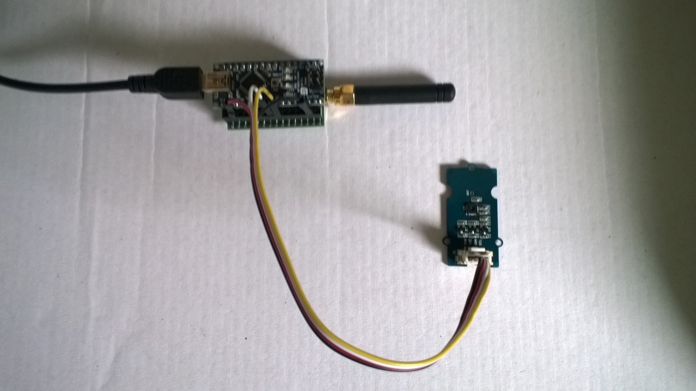

# FieldGateway.LoRa.ArduinoNanoEasySensorsClient

Sample [Arduino Nano](https://www.arduino.cc/en/Guide/ArduinoNano) clients for my [LoRa](https://lora-alliance.org/) field gateway projects

I used [Arduino-Lora](https://github.com/sandeepmistry/arduino-LoRa) and [Silicon Labs Si7005](https://github.com/Seeed-Studio/Grove_Temper_Humidity_TH02) thank you to the authors Sandeep Mistry & Seeedstudio.

My Netduino clients use
* [Arduino Nano radio shield RFM69/95](https://www.tindie.com/products/easySensors/arduino-nano-radio-shield-rfm6995-or-nrf24l01/) 
  [SeeedStudio Grove-Temperature & Humidity Sensor ](https://www.seeedstudio.com/Grove-Temperature%26Humidity-Sensor-%28High-Accuracy-%26-Mini%29-p-1921.html)
* [SeeedStudio Grove-Universal 4 Pin Buckled 5cm Cable](https://www.seeedstudio.com/Grove-Universal-4-Pin-Buckled-5cm-Cable-%285-PCs-Pack%29-p-925.html)
* [SeeedStudio Grove-Base Shield V2](https://www.seeedstudio.com/Base-Shield-V2-p-1378.html)
* [Arduino Nano](https://makerfabs.com/index.php?route=product/product&product_id=227)

